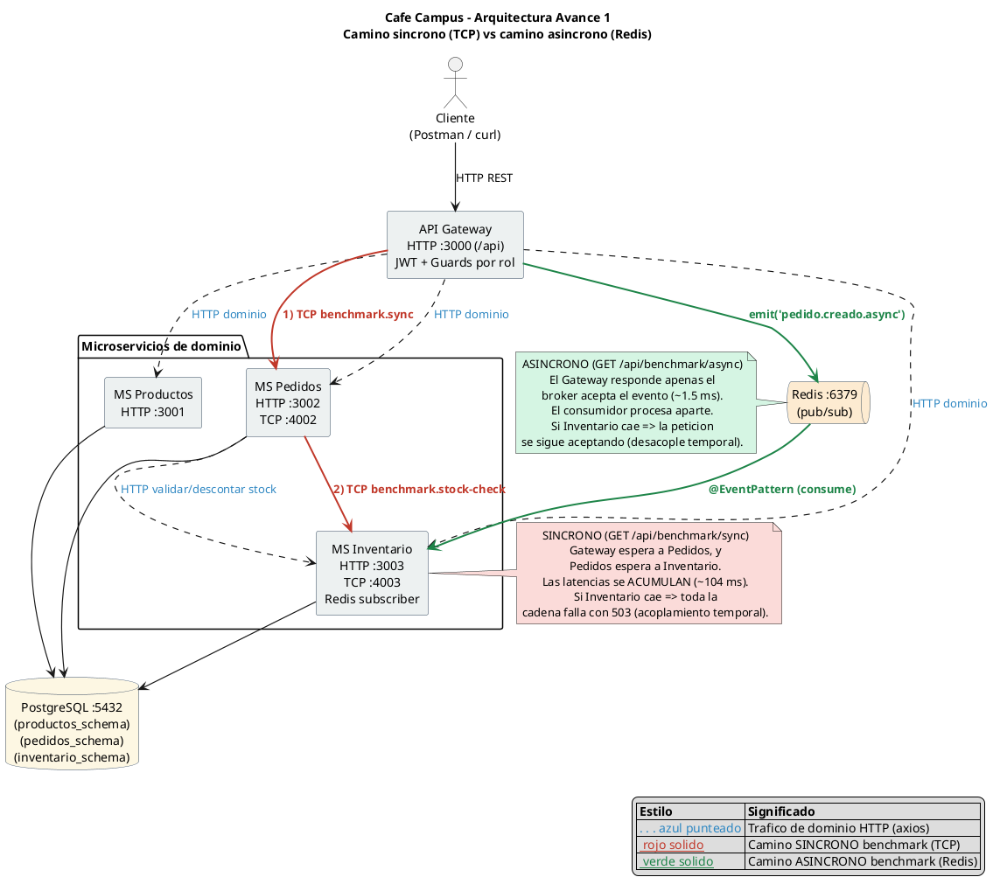
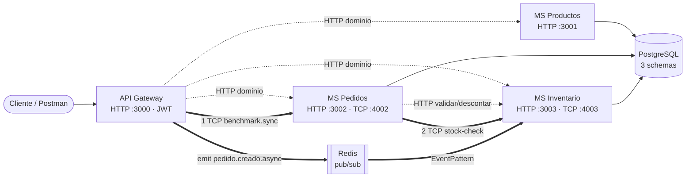
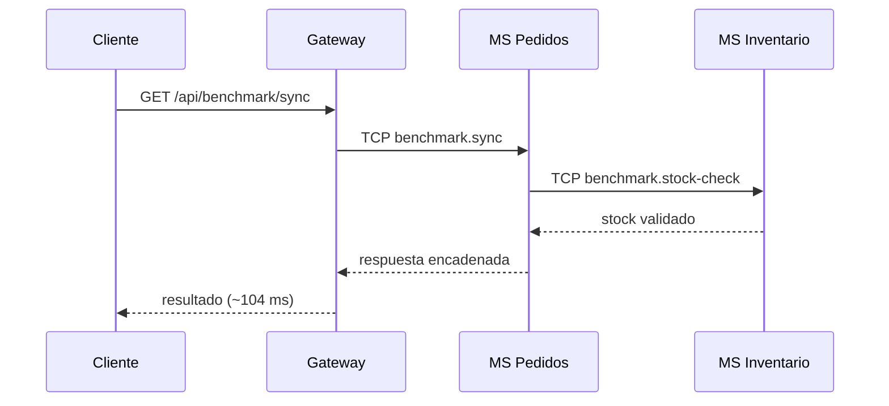
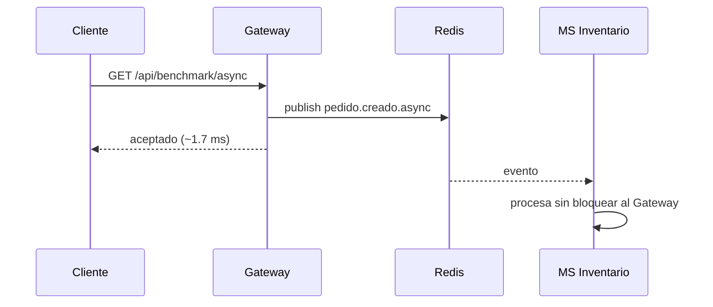
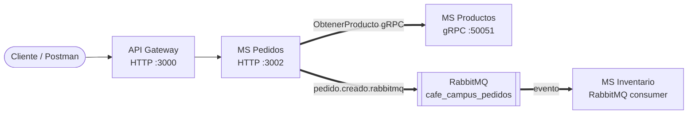

# Cafe Campus

> MVP de arquitectura de microservicios · Aplicaciones Distribuidas · 7.º semestre · Entrega por avances.

Cafe Campus es un sistema de cafetería universitaria construido como **monorepo de microservicios**
(NestJS + TypeScript + Prisma + PostgreSQL) con **frontend Angular** para el demo final. El objetivo pedagógico es **demostrar con datos reales
el acoplamiento temporal y la acumulación de latencia** entre comunicación síncrona y asíncrona.

## Equipo

| Integrante     | Rol                                            | GitHub      |
| -------------- | ---------------------------------------------- | ----------- |
| Marcos Escobar | Arquitectura · API Gateway · Integración       | @IMarcusDev |
| Mateo Sosa     | Backend · Transportes (TCP + Redis)            | @MatSosa1   |
| Stefany Díaz   | Persistencia · Documentación · QA · Mediciones | @Steft91    |

## Descripción del MVP

Cafe Campus administra el catálogo de productos, registra pedidos de estudiantes y controla el
inventario de la cafetería. El dominio se mantiene **deliberadamente simple** para centrar el
esfuerzo en la **arquitectura de comunicación**, las buenas prácticas y la evidencia medible, no
en la lógica de negocio.

- **MS Productos:** catálogo, categorías, precios y disponibilidad (HTTP + gRPC).
- **MS Pedidos:** registra pedidos, calcula totales y coordina validación/descuento de stock.
- **MS Inventario:** controla existencias y movimientos; expone los handlers de benchmark.
- **API Gateway:** punto único de entrada HTTP, autenticación JWT y proxy hacia los servicios.
- **Frontend Angular:** interfaz de demo para estudiante, mesero y admin conectada al Gateway.

## Stack

- **Frontend:** Angular + TypeScript.
- **Backend:** NestJS + TypeScript · **Estructura:** monorepo (4 apps independientes).
- **Síncrono (Avance 1):** TCP con `@nestjs/microservices` · **Eventos (Avance 1):** Redis PUB/SUB.
- **Avance 2:** gRPC para consulta de productos y RabbitMQ como segundo transporte asíncrono.
- **Persistencia:** PostgreSQL (un `schema` por servicio) · **ORM:** Prisma.
- **Seguridad base:** JWT + Guards por rol en el Gateway · **Observabilidad:** Sentry.
- **Contenedores:** Docker Compose para backend e infraestructura; frontend local para demo.

> **Equivalencia con lo visto en clase:** la guía sugiere **TypeORM**; este proyecto usa **Prisma**,
> que cumple el mismo rol de ORM sobre PostgreSQL. El camino síncrono usa **TCP**, el primer camino
> asíncrono usa **Redis pub/sub** y el Avance 2 incorpora **gRPC** y **RabbitMQ** como segundo transporte.

## Cómo ejecutar

### Opción A — Docker Compose (un solo comando)

```bash
docker compose up -d
docker compose ps

curl http://localhost:3000/api/benchmark/sync
curl http://localhost:3000/api/benchmark/async
```

Para la entrega final con JWT/Sentry/RabbitMQ y puertos sin conflicto:

```bash
docker compose -f docker-compose.final.yml up -d
docker compose -f docker-compose.final.yml ps
```

Si se levanta una base nueva en Docker, aplicar migraciones y seeds. Para el compose final, usar los mismos comandos agregando `-f docker-compose.final.yml`:

```bash
docker compose exec ms-productos npx prisma migrate deploy --schema src/prisma/schema.prisma
docker compose exec ms-pedidos npx prisma migrate deploy --schema src/prisma/schema.prisma
docker compose exec ms-inventario npx prisma migrate deploy --schema src/prisma/schema.prisma

docker compose exec ms-productos npm run seed
docker compose exec -e MS_PRODUCTOS_URL=http://ms-productos:3001 ms-inventario npm run seed
```

### Frontend Angular

El frontend se ejecuta localmente y consume el Gateway en `http://localhost:3000/api`:

```bash
cd frontend
npm install
npm run start
```

Abrir `http://localhost:4200`. Cuentas demo:

| Rol | Correo | Clave | Funcionalidad |
|---|---|---|---|
| Estudiante | `estudiante@campus.edu` | `est123` | Menú, carrito, creación de pedido y seguimiento de estado. |
| Mesero | `personal@campus.edu` | `personal123` | Atención de pedidos y cambio de estados. |
| Admin | `admin@campus.edu` | `admin123` | Administración de productos y supervisión de pedidos. |

### Opción B — Local (sin Docker)

Levantar PostgreSQL y Redis, ejecutar migraciones y arrancar en orden:

```bash
# 1) Migraciones (dentro de cada servicio con Prisma)
cd ms-productos  && npx prisma migrate dev --schema src/prisma/schema.prisma && npm run seed
cd ../ms-inventario && npx prisma migrate dev --schema src/prisma/schema.prisma && npm run seed
cd ../ms-pedidos && npx prisma migrate dev --schema src/prisma/schema.prisma

# 2) Arranque en orden
cd ms-productos && npm run start:dev
cd ms-inventario && npm run start:dev
cd ms-pedidos && npm run start:dev
cd gateway && npm run start:dev
```

### Puertos

| Servicio      | HTTP                  | Transporte interno |
| ------------- | --------------------- | ------------------ |
| gateway       | 3000 (prefijo `/api`) | TCP cliente, Redis publisher |
| ms-productos  | 3001                  | gRPC 50051 |
| ms-pedidos    | 3002                  | TCP 4002, gRPC cliente, RabbitMQ publisher |
| ms-inventario | 3003                  | TCP 4003, Redis subscriber, RabbitMQ consumer |
| PostgreSQL    | 5432                  | Base `cafe_campus` con schemas separados |
| Redis         | 6379                  | Pub/Sub |
| RabbitMQ      | 5672 / panel 15672    | Cola `cafe_campus_pedidos` |
| Frontend      | 4200                  | Angular dev server |

> En `docker-compose.final.yml` se exponen puertos externos alternos para evitar conflictos locales: PostgreSQL `15432`, Redis `16379`, RabbitMQ `15674/15673`, MS Productos `13001/15051`, MS Pedidos `13002/14002` y MS Inventario `13003/14003`.

## Arquitectura



> Diagrama generado con **PlantUML**. Fuente:
> [`arquitectura-avance1.puml`](docs/planificacion-avance1/arquitectura-avance1.puml) ·
> versión vectorial: [`arquitectura-avance1.svg`](docs/planificacion-avance1/arquitectura-avance1.svg).
> Regenerar con: `plantuml -tpng docs/planificacion-avance1/arquitectura-avance1.puml`

Vista simplificada de los dos caminos:



### Camino síncrono (TCP)



### Camino asíncrono (Redis)



## Metodología

- **Kanban:** ver [`TABLERO_KANBAN.md`](TABLERO_KANBAN.md) y el reparto en
  [`docs/planificacion-avance1/01-roles-y-kanban.md`](docs/planificacion-avance1/01-roles-y-kanban.md)
  (captura en `docs/avance1-evidencias/avance1-kanban.png`).
- **Ramificación:** **GitHub Flow** — `main` como rama principal y ramas `feat/…`, `chore/…` y `docs/…` para separar funcionalidades, configuración y documentación. Las ramas se integran mediante Pull Requests y se utiliza un **tag por avance**.
- **Commits semánticos:** Conventional Commits `tipo(alcance): descripción`. Ejemplos:
    ```
    feat(tcp): agregar handler tcp de verificacion de stock
    feat(redis): agregar consumidor asincrono de eventos de pedido
    feat(gateway): agregar proxy http hacia ms-pedidos
    docs(readme): completar seccion avance 1 con analisis y evidencia
    ```

## Patrones y principios aplicados

Resumen (detalle y justificación en
[`docs/planificacion-avance1/02-patrones-y-principios.md`](docs/planificacion-avance1/02-patrones-y-principios.md)
y [`docs/planificacion-avance2/02-patrones-y-principios.md`](docs/planificacion-avance2/02-patrones-y-principios.md)):

| Patrón / Principio | ¿Framework o equipo? | Avance |
|---|---|---|
| API Gateway y Proxy | Diseñados por el equipo | 1 |
| Publisher/Subscriber (Redis) y Request/Response (TCP) | Equipo, utilizando transportes de NestJS | 1 |
| DTO, `ValidationPipe`, inyección de dependencias y módulos | Proporcionados por NestJS y utilizados deliberadamente | 1 |
| Excepciones HTTP y manejo controlado de errores | Framework y uso deliberado del equipo | 1–2 |
| SRP, separación de responsabilidades y aislamiento de datos por `schema` | Diseño del equipo | 1 |
| RPC con contrato (gRPC) y contrato `.proto` compartido | Equipo, sobre `Transport.GRPC` de NestJS | 2 |
| Pub/Sub sobre cola durable (RabbitMQ) | Equipo, sobre `Transport.RMQ` de NestJS | 2 |
| Snapshot de producto y traducción de errores gRPC→HTTP 422 | Diseño del equipo | 2 |
| JWT + Guards por rol | NestJS + diseño del equipo en Gateway | 3 |
| Observabilidad de errores con Sentry | Equipo, integrado en Gateway | 3 |
| UI por rol conectada al Gateway | Diseño del equipo con Angular | 3 |
---

## Avance 1 — Acoplamiento temporal y latencia · `tag v1-avance1`

### Caminos

- **Síncrono (TCP):** Gateway → MS Pedidos → MS Inventario (cada salto espera al siguiente).
- **Asíncrono (Redis):** Gateway publica el evento y responde sin esperar al consumidor.

| Camino    | Endpoint                   | Transporte |
| --------- | -------------------------- | ---------- |
| Síncrono  | `GET /api/benchmark/sync`  | TCP        |
| Asíncrono | `GET /api/benchmark/async` | Redis      |

### Latencia (200 peticiones, `benchmark.js`)

```bash
node benchmark.js http://localhost:3000/api/benchmark/sync 200 > docs/avance1-evidencias/avance1-benchmark-sync.txt
node benchmark.js http://localhost:3000/api/benchmark/async 200 > docs/avance1-evidencias/avance1-benchmark-async.txt
```

| Camino          | Promedio (ms) | p95 (ms) | Máx (ms) | Errores |
| --------------- | ------------: | -------: | -------: | ------: |
| Síncrono TCP    |    **104.89** |   106.00 |   162.00 |       0 |
| Asíncrono Redis |      **1.67** |     2.00 |    70.00 |       0 |

### Acoplamiento temporal (prueba de caída)

Con el stack arriba, se apaga **MS Inventario** (Ctrl+C) y se repiten las peticiones
(evidencia en `docs/avance1-evidencias/avance1-caida-servicio.txt`):

- **Síncrono → falla** con `503 Service Unavailable`: la cadena Gateway→Pedidos→Inventario requiere que todos estén vivos a la vez.
- **Asíncrono → se acepta igual** (`"aceptado": true`, ~1 ms): el Gateway publica el evento en Redis y responde sin esperar una confirmación del consumidor. Esto demuestra un menor acoplamiento temporal desde la perspectiva del emisor.

**Resultados del benchmark del camino síncrono**


**Resultados del benchmark del camino asíncrono**


### Análisis

En el camino **síncrono**, cada salto espera la respuesta del siguiente antes de continuar, por lo que los tiempos de procesamiento se acumulan. El promedio medido fue de **104.89 ms**, valor coherente con los retardos artificiales de MS Pedidos (40 ms) y MS Inventario (60 ms), además del costo de comunicación entre procesos. La prueba de caída también evidenció **acoplamiento temporal**: al detener MS Inventario, la cadena no pudo completarse y el Gateway respondió con un error **503 Service Unavailable**.

En el camino **asíncrono**, el Gateway publica un evento mediante Redis Pub/Sub y responde sin esperar que MS Inventario complete su procesamiento. Por esta razón, el promedio de respuesta fue de **1.67 ms**. Incluso con el consumidor detenido, el Gateway aceptó la solicitud y respondió correctamente, evidenciando un menor acoplamiento temporal desde la perspectiva del emisor.

Sin embargo, Redis Pub/Sub utiliza mensajería no persistente. Por ello, esta implementación demuestra desacoplamiento temporal y reducción del tiempo de respuesta, pero no garantiza que un evento publicado mientras el consumidor está detenido sea procesado posteriormente.

Análisis ampliado en
[`docs/planificacion-avance1/03-analisis-latencia-acoplamiento.md`](docs/planificacion-avance1/03-analisis-latencia-acoplamiento.md).

---

## Avance 2 — Comunicación: gRPC + 2.º transporte + excepciones · `tag v2-avance2`

### Implementación

- **gRPC:** `ms-pedidos -> ms-productos`, usando el contrato
  [`proto/productos.proto`](proto/productos.proto).
- **RabbitMQ:** `ms-pedidos -> ms-inventario`, publicando el evento
  `pedido.creado.rabbitmq` en la cola `cafe_campus_pedidos`.
- **Error controlado:** si `ms-productos` responde `NOT_FOUND` por gRPC, `ms-pedidos` captura el
  error y responde al cliente con `422` sin tumbar el servicio.


> Diagrama generado con **PlantUML**. Fuente:
> [`arquitectura-avance2.puml`](docs/planificacion-avance2/arquitectura-avance2.puml) ·
> versión vectorial: [`arquitectura-avance2.svg`](docs/planificacion-avance2/arquitectura-avance2.svg).
> Regenerar con: `plantuml -tpng docs/planificacion-avance2/arquitectura-avance2.puml`

Vista simplificada de los transportes nuevos:



### Flujo validado

Para crear un pedido, el cliente envía solamente `productoId` y `cantidad`. `ms-pedidos` consulta
el producto por gRPC, toma el `nombre` y `precio` reales desde `ms-productos`, calcula el total,
persiste el pedido y publica un evento en RabbitMQ para `ms-inventario`.

Evidencias:

- Pedido exitoso: [`docs/avance2-evidencias/flujo-pedido-grpc-rabbitmq.txt`](docs/avance2-evidencias/flujo-pedido-grpc-rabbitmq.txt)
- Consumidor RabbitMQ: [`docs/avance2-evidencias/rabbitmq-inventario.txt`](docs/avance2-evidencias/rabbitmq-inventario.txt)
- Captura RabbitMQ: [`docs/avance2-evidencias/avance2-rabbitmq-inventario-log.png`](docs/avance2-evidencias/avance2-rabbitmq-inventario-log.png)
- Error gRPC controlado: [`docs/avance2-evidencias/error-producto-inexistente-grpc.txt`](docs/avance2-evidencias/error-producto-inexistente-grpc.txt)
- Captura del error: [`docs/avance2-evidencias/avance2-error-producto-inexistente-grpc.png`](docs/avance2-evidencias/avance2-error-producto-inexistente-grpc.png)

### Comparativa de transportes

| Transporte | Uso en el proyecto | Tipo | Ventaja principal | Limitación |
|---|---|---|---|---|
| HTTP | Gateway hacia servicios | Síncrono request/response | Simple de probar y exponer | Mayor acoplamiento entre cliente y servicio |
| TCP NestJS | Benchmark Avance 1 | Síncrono interno | Ligero para comunicación entre microservicios NestJS | El emisor espera toda la cadena |
| Redis Pub/Sub | Benchmark asíncrono Avance 1 | Asíncrono no persistente | Muy baja latencia para publicar | Si el consumidor está caído, el evento puede perderse |
| gRPC | Pedidos consulta Productos | Síncrono tipado | Contrato `.proto`, eficiente y explícito | Requiere mantener contrato y cliente/servidor compatibles |
| RabbitMQ | Pedidos notifica Inventario | Asíncrono con cola | Desacopla emisor/consumidor y permite cola durable | Más infraestructura y configuración |

Planificación técnica del avance:
[roles y Kanban](docs/planificacion-avance2/01-roles-y-kanban.md) ·
[patrones y principios](docs/planificacion-avance2/02-patrones-y-principios.md) ·
[comparación de transportes y excepciones](docs/planificacion-avance2/03-comparacion-transportes-excepciones.md) ·
[plan de commits](docs/planificacion-avance2/04-plan-de-commits.md).

## Avance 3 — Seguridad, observabilidad e integración (FINAL) · `tag v3-final`

### Seguridad y roles

El Gateway centraliza autenticación y autorización:

- `POST /api/auth/login` emite JWT para usuarios mock de demo.
- Rutas sin token responden `401 Unauthorized`.
- Rutas con token válido pero rol insuficiente responden `403 Forbidden`.
- Rutas con rol autorizado responden correctamente (`200`).

Evidencias:

- Login JWT: [`docs/avance3-evidencias/login-jwt.txt`](docs/avance3-evidencias/login-jwt.txt) · [`png`](docs/avance3-evidencias/login-jwt.png)
- Ruta autorizada: [`docs/avance3-evidencias/ruta-protegida-200.txt`](docs/avance3-evidencias/ruta-protegida-200.txt) · [`png`](docs/avance3-evidencias/ruta-con-token-valido-200.png)
- Sin token: [`docs/avance3-evidencias/ruta-sin-token-401.txt`](docs/avance3-evidencias/ruta-sin-token-401.txt) · [`png`](docs/avance3-evidencias/ruta-sin-token-401.png)
- Rol insuficiente: [`docs/avance3-evidencias/ruta-rol-sin-permiso-403.txt`](docs/avance3-evidencias/ruta-rol-sin-permiso-403.txt) · [`png`](docs/avance3-evidencias/rol-sin-permiso-403.png)

### Observabilidad

El Gateway integra Sentry para capturar errores HTTP relevantes con contexto de servicio, ruta, método,
estado y entorno. La evidencia usa un error controlado de producto inexistente que pasa por Gateway y
queda registrado en Sentry.

- Error controlado: [`docs/avance3-evidencias/error-controlado-status.txt`](docs/avance3-evidencias/error-controlado-status.txt)
- Evento en Sentry: [`docs/avance3-evidencias/avance3-sentry-error-capturado.png`](docs/avance3-evidencias/avance3-sentry-error-capturado.png)
- Tags/contexto: [`docs/avance3-evidencias/avance3-sentry-tags-contexto.png`](docs/avance3-evidencias/avance3-sentry-tags-contexto.png)

### Integración final

Flujo probado:

```text
Frontend/Postman -> Gateway JWT -> MS Pedidos -> MS Productos gRPC -> RabbitMQ -> MS Inventario
```

- Flujo integrado: [`docs/avance3-evidencias/flujo-integrado-final.txt`](docs/avance3-evidencias/flujo-integrado-final.txt) · [`png`](docs/avance3-evidencias/flujo-integrado-final.png)
- Evento RabbitMQ: [`docs/avance3-evidencias/flujo-integrado-rabbitmq-inventario.txt`](docs/avance3-evidencias/flujo-integrado-rabbitmq-inventario.txt) · [`png`](docs/avance3-evidencias/rabbitmq-recibido-inventario.png)
- Stack final: [`docs/avance3-evidencias/servicios-finales-ps.txt`](docs/avance3-evidencias/servicios-finales-ps.txt) · [`png`](docs/avance3-evidencias/servicios-finales.png)

### Frontend de demo

Se agregó una interfaz Angular para mostrar el sistema como producto usable, no solo como API:

- **Estudiante:** visualiza menú disponible, agrega al carrito, crea pedidos y consulta estado.
- **Mesero:** revisa pedidos y avanza estados de preparación.
- **Admin:** crea productos, cambia precio, pausa/activa disponibilidad, elimina productos y supervisa pedidos.

La interfaz consume exclusivamente el Gateway (`/api`) y respeta los permisos configurados por rol.

### Kanban final

Captura del tablero actualizado: [`docs/avance3-evidencias/avance3-kanban.png`](docs/avance3-evidencias/avance3-kanban.png).

Planificación técnica del avance:
[`runbook de demo`](docs/planificacion-avance3/01-runbook-demo.md) ·
[`guion de defensa`](docs/planificacion-avance3/02-guion-defensa.md) ·
[`planificación final`](docs/planificacion-avance3/README.md).

## Defensa

La defensa se centra en explicar por qué cada transporte se usa en un caso distinto:

- HTTP para entrada externa y pruebas simples.
- TCP para benchmark síncrono y demostración de latencia acumulada.
- Redis Pub/Sub para publicación rápida sin esperar consumidor.
- gRPC para consulta tipada de productos desde pedidos.
- RabbitMQ para evento durable de pedido creado hacia inventario.

Además, se demuestra control de acceso en Gateway con JWT/roles, observabilidad con Sentry y una
interfaz Angular que permite probar los flujos reales por rol.

## Tags de entrega

- `v1-avance1` — 2026-07-14
- `v2-avance2` — creado tras merge del Avance 2
- `v3-final` — pendiente de creación al cerrar la entrega final
